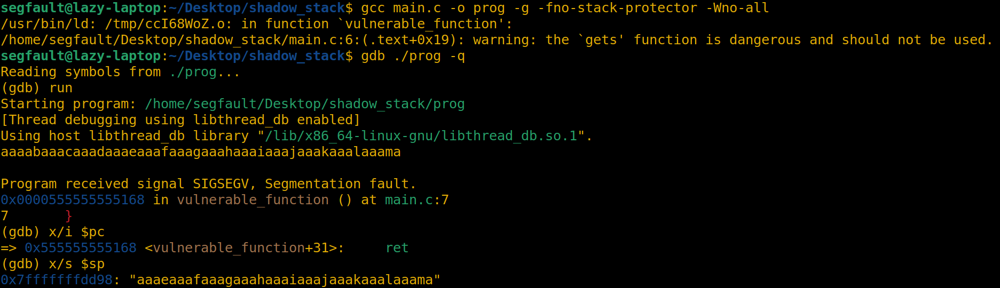
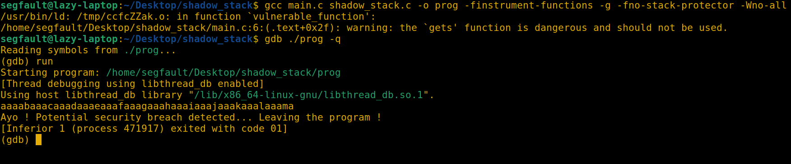

# Shadow Stack

This project is a basic implementation of a shadow stack in C language.   
It prevents rewriting stack addresses by creating a new stack called **shadow stack**, and can help mitigate stack-based buffer overflow exploitation techniques such as **ROP** *(Return-Oriented Programming)*.

## How does it work ?

Some **GCC built-in** functions have been used :
- `__cyg_profile_func_enter` : Allows for automatic profiling by inserting `__cyg_profile_func_enter` at the entry of each function in the code. 
- `__cyg_profile_func_exit` : Allows for automatic profiling by inserting `__cyg_profile_func_exit` at the exit of each function in the code.
- `__builtin_return_address(N)` : Returns the return address of a function from specified callstack level (defined by N).

At the beginning of `main` function, the **shadow stack** is allocated on the heap using `sbrk`.  
Then, the return address of the next callstack level is pushed to this **shadow stack**.  

When a function will exit, the previous return address is popped and compared with the one from the next callstack level.  
If the two addresses are not the same then it means that you have data corruption on the stack and potentially a vulnerability. The program exits. 

## Pros

- Because of `mprotect` call, the **shadow stack** is not accessible when not in `__cyg_profile_func_XXX` function. So, no leak (data reading) is possible from there.  
- Automatic protection just by linking files and adding `-finstrument-functions` during **GCC** compilation.

## Cons

- It only protects from `main` function and inside it, but it doesn't protect outside `main` function.
- The **shadow stack** size is static.
- Loss of performance during execution because some code is added at enter and exit of each functions, using syscalls.

## Proof of concept

### Vulnerable code used
```C
#include <stdio.h>

void vulnerable_function(void)
{
    /* This function is vulnerable to stack-based buffer overflow because of gets() function */
    char buffer[5];
    gets(buffer); // gets function is vulnerable. Never use it.
}

int main(void)
{
    vulnerable_function();
    return 1;
}
```

### Without shadow stack protection



A **SIGSEGV** occurs and the program crashed.

### With shadow stack protection



The program exited normally after printing an error message.
